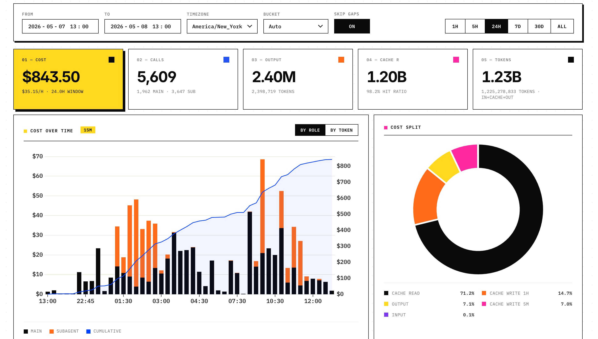

# tokmeter

A fast, local dashboard for Claude Code and Codex token usage and API-equivalent
cost estimates. Reads your JSONL logs directly, with no uploads, telemetry,
network pricing requests, or persistent usage cache.

<p align="center">
  
</p>

## Install

This checkout is the **0.2.0 source release**. Building from source requires
Python 3.10+ and a Rust toolchain (1.83+):

```bash
python -m pip install .
tokmeter
```

An already-built platform wheel can be installed without Rust:

```bash
python -m pip install /path/to/tokmeter-0.2.0-<platform>.whl
```

The dashboard opens at `http://127.0.0.1:8765/`. Press `Ctrl-C` to stop.
The previous single-file `uv run tokmeter.py` entry point has been replaced by
the package and native extension. A PyPI installation only includes this upgrade
after version 0.2.0 is published there.

```bash
tokmeter --port 8866 --no-open
tokmeter --workers 4 --interval 2
tokmeter --claude-dir /path/to/claude/projects --codex-dir /path/to/codex
```

`CLAUDE_CONFIG_DIR`, `CODEX_HOME`, and `TOKMETER_PORT` override the default roots
and port. `--host 0.0.0.0` exposes this unauthenticated dashboard to your LAN;
keep the default loopback address for private local use.

## How loading works

1. The HTTP server serves the bundled page immediately while usage loads.
2. A Rust reader scans files with up to 8 worker threads, normalizes usage, and
   sends compact numeric columns to Python/Polars.
3. Readers query immutable in-memory snapshots. Background scans do not lock
   HTTP queries. The default scan interval is one second.
4. Unchanged files need only metadata checks. Changed files are read from their
   last complete line; inode changes, truncation, same-size rewrites, and changed
   append boundaries cause that file to be rebuilt.

All parsed rows, file offsets, and aggregate frames live **only in RAM** and
are discarded on exit. The source JSONL files are the source of truth. There is
no SQLite index, persisted parsed-data copy, or cache directory to maintain.
The OS can still cache source files, and the browser can cache bundled static
assets. Neither is an application usage database.

Sources include Claude's `projects/**/*.jsonl` and Codex's `sessions/**/*.jsonl`
and `archived_sessions/**/*.jsonl`. The reader does not inspect Codex's large
SQLite debug log database. It treats logs as append-only between detectable
replacements: a rewrite of an old prefix followed by growth that preserves the
last read boundary cannot be detected from metadata alone. Restart for a full
reread after externally editing historical logs.

## Dashboard

- Claude, Codex, and combined views; by-project and by-model breakdowns.
- Rolling `1H / 5H / 24H / 7D / 30D / All` windows and custom date ranges.
- UTC, America/New_York, or the browser's local IANA timezone, including DST.
- Cost by agent role and all seven token cost components; virtualized table.
- Adaptive buckets from one minute to one day, capped at 5,000 per response.
- Refresh every two seconds while visible; outdated requests cannot replace
  a newer selection. Manual refresh schedules an asynchronous source scan.
- JS, CSS, and chart libraries are bundled. No CDN or web font is needed.

## Counting and pricing

Codex's repeated unchanged cumulative usage snapshots are counted once. A
cumulative reset starts a new segment. An explicit fork's historical events
before its creation timestamp are excluded when that metadata exists; logs
without sufficient fork metadata cannot be reliably distinguished from newly
consumed usage. Claude messages are deduplicated by message ID, retaining the
snapshot with the greatest output usage (latest timestamp breaks ties).
Partial final JSONL lines are retried after the next append. Malformed usage
records are skipped individually and reported in the status.

Codex input includes cached input, and output includes reasoning: these subsets
are split for display without being added twice. Claude's separate 5-minute
and 1-hour cache writes and cache reads are preserved. Cache writes with no
reported TTL use the standard 5-minute rate.

Prices are explicit model entries in [`prices.json`](python/tokmeter/prices.json),
with dated model suffix normalization and explicit aliases. Unknown models
remain visible as **unpriced**, and partial totals are marked. Service-tier
multipliers are applied only when a supported tier is recorded on the usage
event; a requested setting in `turn_context` is not proof of a served tier.
Missing or unsupported tiers are labeled as estimates at standard rates.

The catalog is a dated reference, **not a historical billing engine**. Its rates
apply to the selected history; subscription charges, negotiated discounts,
provider routing, and unlogged service tiers cannot be recovered from these
logs. Amounts represent API-equivalent estimates, not your actual invoice.
Current catalog sources: [OpenAI pricing](https://developers.openai.com/api/docs/pricing)
and [Anthropic pricing](https://platform.claude.com/docs/en/about-claude/pricing).

Override individual model entries and aliases with `--prices prices.local.json`.
Model entries replace the complete entry; rates are USD per million tokens:

```json
{
  "models": {
    "my-model": {"input": 2, "cached": 0.2, "output": 10}
  },
  "aliases": {"my-model-alias": "my-model"}
}
```

## API

| Endpoint | Behavior |
|---|---|
| `GET /api/status` | Readiness, scan diagnostics, catalog version |
| `GET /api/aggregate` | Snapshot query; `202` while initial loading is in progress |
| `POST /api/refresh` | Schedule a background scan; returns immediately with `202` |

Aggregation requires `from` and `to` as UTC epoch milliseconds, with an inclusive
start and exclusive end. Options: `source=cc|codex|all`,
`granularity=1m|5m|15m|30m|1h|6h|1d`, `tz=UTC|ET|<IANA name>`, and
`gaps=fill|skip`. Invalid requests return `400`; overly fine bucket sizes are
coarsened. Time windows longer than roughly 13 years are rejected.

## Development and validation

```bash
uv venv
source .venv/bin/activate
uv pip install maturin pytest polars numpy
maturin develop --release
python -B -m pytest -q
cargo fmt --manifest-path native/Cargo.toml -- --check
cargo clippy --manifest-path native/Cargo.toml --all-targets -- -D warnings
maturin build --release --out dist
```

On Windows, activate with `.venv\Scripts\activate` instead. If both Conda and
a virtual environment are active, deactivate Conda first.

The boundaries are `native/src/parser.rs` (source adapters),
`native/src/engine.rs` (incremental ingestion), `python/tokmeter/engine.py`
(snapshot publication), `pricing.py`, `query.py`, and `server.py`. The frontend
is in `python/tokmeter/static/`; vendor versions and licenses are recorded there.

```bash
python -B scripts/benchmark.py                 # Temporary synthetic inputs
python -B scripts/benchmark.py --real --runs 3 # Explicitly read local history
```

The benchmark prints only aggregate performance metadata and removes temporary
inputs on exit. It does not purge OS file caches. On the development Mac, about
10.4 GB / 5,934 files loaded in 1.05–1.48 seconds in three initial measurements,
with full-history aggregation in 62–84 ms. Results depend on storage, CPU,
log shape, and OS cache state; they are not a cold-disk guarantee. Run each
measurement in a fresh process for an independent peak-RSS value.
